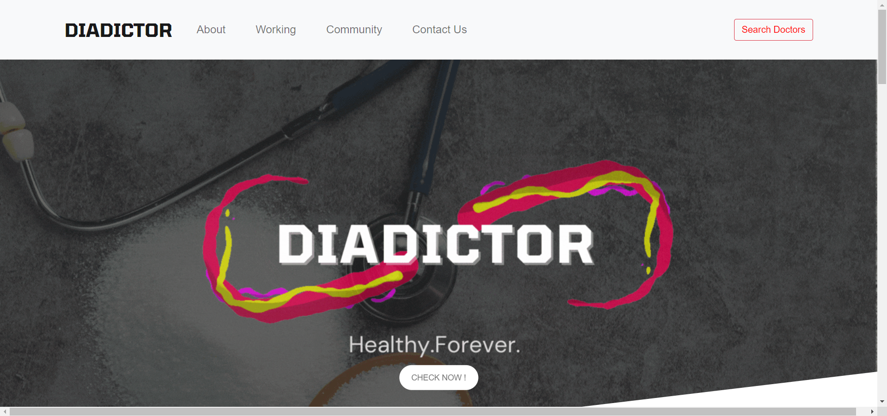

<!-- PROJECT LOGO -->
<br />
<p align="center">
  <a href="https://github.com/othneildrew/Best-README-Template">
    
  </a>

  <h1 align="center">Diadictor</h1>
  

  <p align="center">
    Healthy Forever 
    <br />
    <!-- <a href="https://github.com/othneildrew/Best-README-Template">Visit website</a> -->
    ·
    <a href="https://github.com/othneildrew/Best-README-Template/issues">Raise an issue</a>
    
  </p>
</p>


<!-- TABLE OF CONTENTS -->
<details open="open">
  <summary>Table of Contents</summary>
  <ol>
    <li>
      <a href="#about-the-project">About The Project</a>
      <ul>
        <li><a href="#built-with">Built With</a></li>
      </ul>
    </li>
    <li>
      <a href="#getting-started">Getting Started</a>
      <ul>
        <li><a href="#prerequisites">Prerequisites</a></li>
        <li><a href="#installation">Installation</a></li>
      </ul>
    </li>
    <li><a href="#usage">Usage</a></li>
    <li><a href="#roadmap">Roadmap</a></li>
    <li><a href="#contributing">Contributing</a></li>
    <li><a href="#contact">Contact</a></li>
  </ol>
</details>


<!-- ABOUT THE PROJECT -->
## About The Project



Diadictor helps you predict what are your chances of having diabetes using machine learning. The user just needs to enter some basic information and the result is shown within seconds, the result is also mailed to the user so that the user has a report that he can refer in future as well. Apart from predicting diabetes it also helps the user to predict what are his/her chances of having black fungus if he/she has ever suffered from covid-19.
The diadictor application not stops here but also helps the user to find diabetologist in their city by using the practo application. Diadictor also has a community page where doctors can come and write useful blogs about diabetes for the patients so that they can read them.

Here's why:
* India is home to 77 Million Diabetics, 2nd highest in the world.
* Bhubaneshwar has 2nd highest number of diabetic patients in India.
* Odisha 6th In Diabetic Deaths In Country.
* Due to the pandemic situation people try to avoid traveliing and going out in public in such a case using Diadictor will help them get an idea about there chances of having diabetes.
* People who suffer from diabetes and who have contacted covid-19 are at a great risk of being infected with black fungus. So we expanded our domain and  added     black fungus risk teller. 
* If the patient feels he/she has slight chances of having diabetes and is confused whether to consult a doctor or not, Diadictor helps you resolve this issue by giving you a prediction on the scale of 10 and even suggesting doctors.

Diadictor is a useful website that helps the patient predict his chances of having diabetes with an accuracy of 76.04% with 4.5% standard deviation, further user can also schedule an appointment with a doctor in his city.
We hope to make diabetes testing in India much easier as it was before.
Healthy Forever

### Built With

The Diadictor is made using:
* HTML
* CSS
* Bootstrap
* Javascript
* JQuery
* Python
* Flask
* MySQL
* Jupyter Notebook


<!-- GETTING STARTED -->
## Getting Started

Instructions to set up Diadictor locally.
To get a local copy up and running follow these simple example steps.

### Prerequisites
You must have Python installed in your local system
This is an example of how to list things you need to use the software and how to install them.
* flask
  ```sh
  pip install flask
  ```
  
* pickle
  ```sh
  pip install pickle
  ```
  
* numpy
  ```sh
  pip install numpy
  ```
  
* smptlib
  ```sh
  pip install smptlib
  ```

* pyyaml
  ```sh
  pip install pyyaml
  ```

* flask_mysqldb
  ```sh
  pip install flask_mysqldb
  ```

### Installation
 
1. Clone the repo
   ```sh
   git clone https://github.com/amankumar11/Diadictor.git
   ```
2. Install dependencies using pip
   ```sh
   pip install dependency_name
   ```


<!-- USAGE EXAMPLES -->
## Usage

In the pandemic times Diadictor makes very easy to predict diabetes just by enetering some basic information. The website also helps you find Diabetologists near you and also has a community page where people can read.

_For more examples, please refer to the [Documentation](https://example.com)_


<!-- ROADMAP -->
## Roadmap

See the [open issues](https://github.com/amankumar11/Diadictor/issues) for a list of proposed features (and known issues).


<!-- CONTRIBUTING -->
## Contributing

Contributions are what make the open source community such an amazing place to learn, inspire, and create. Any contributions you make are **greatly appreciated**.

1. Fork the Project
2. Create your Feature Branch (`git checkout -b DiadictorNewFeature`)
3. Commit your Changes (`git commit -m 'Add some NewFeature'`)
4. Push to the Branch (`git push origin NewFeature`)
5. Open a Pull Request


<!-- CONTACT -->
## Contact
<li>
Aman Kumar - [Github](https://github.com/amankumar11)
<li>
Bakul Gupta - [Github](https://github.com/Bakul-G)
<li>
Ishaan Gupta - [Github](https://github.com/Majin-Ishaan)
<li>
Nikhil Bakshi - [Github](https://github.com/bonvagnik)


